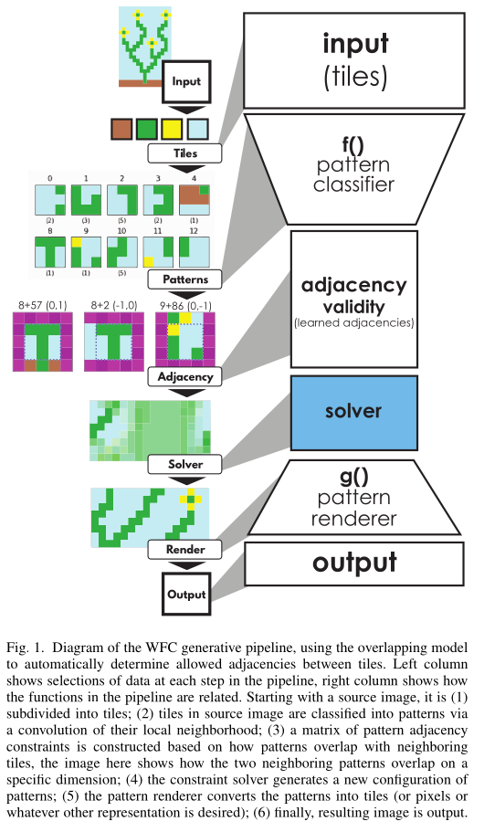
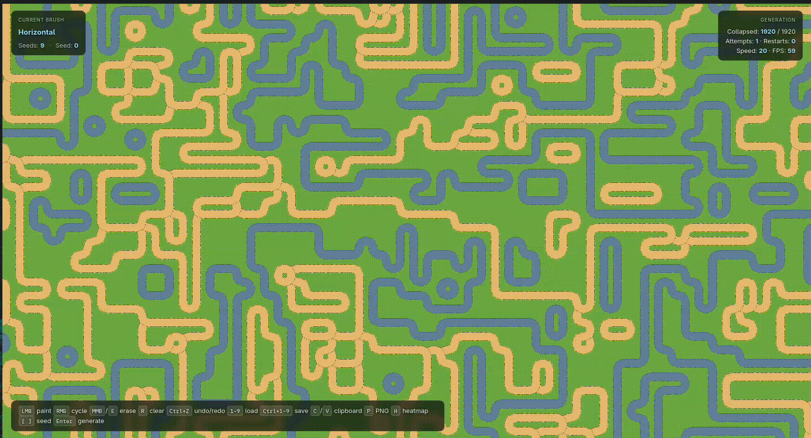

# WFC — Wave Function Collapse road generator

An interactive road-map generator using [Wave Function Collapse](https://en.wikipedia.org/wiki/Wave_function_collapse).
Paint a starting pattern of roads, hit **Enter**, and watch the algorithm fill in a
coherent city-style grid that respects the edges you drew.

C + [raylib](https://www.raylib.com/). Single source file (now split into `src/`). Runs on the desktop
and in the browser (Wasm via Emscripten).





## What it does

- 58 tile types: horizontal/vertical roads, four corners, an empty grass tile, a 4-way crossing, four T-junctions, water variants, bank variants, and grass bank strips.
- Edge-based adjacency (each tile declares which of its four sides are road, empty, water, or bank; neighbours must agree on the shared edge).
- Weighted collapse: straights and empty dominate, so the output reads as a road network rather than visual noise.
- Deterministic: the same seed always produces the same map. Step the seed with `[` and `]`.
- Auto-recovery: contradictions restart from the same seeds, and after 50 consecutive restarts the oldest seed is dropped automatically.

## Controls

**Drawing mode** (you start here):
- `LMB` — paint with the current brush
- `RMB` — cycle to the next brush
- Click any tile in the top strip — pick that brush
- `MMB` or `E` — erase
- `R` — clear all seeds
- `[` / `]` — step the deterministic seed
- `Ctrl+Z` / `Ctrl+Shift+Z` — undo / redo (64 deep)
- `1`–`9` — load a saved pattern slot
- `Ctrl+1`–`Ctrl+9` — save the current pattern to that slot
- `C` — copy the current seed pattern to the clipboard
- `V` — paste a seed pattern from the clipboard
- `P` — export the current map as a PNG (`wfc-map.png`)
- `H` — toggle the entropy heatmap debug overlay
- `Enter` / `Space` — start generation

**Generating mode**:
- `R` — restart from the same seeds
- `M` — back to drawing (progress cleared, seeds kept)
- `Space` — step once
- `[` / `]` — slow / speed the generation (1–200 cells per frame)
- `P` — export the current map as a PNG

## Build

### Desktop
```sh
make            # builds build/main
make run        # build + run
make test       # build + run unit tests
make clean
```

Requires the raylib development headers (Debian/Ubuntu: `apt install libraylib-dev`).
Run from the repo root — tile textures are loaded from relative `assets/tilesets/*.png` paths.

### Web (Wasm)
```sh
make web        # one-time: install emsdk per docs/AGENTS.md, then run build-web.sh
```
The output is `web/index.html` + `index.js` + `index.wasm` + `index.data`.
Serve with any static server: `python3 -m http.server 8080` → <http://localhost:8080/web/>.

You can pre-populate the drawing via a URL parameter:
`http://localhost:8080/web/?seeds=3,5,0;4,5,1;`

## Architecture

See [docs/AGENTS.md](docs/AGENTS.md) for the developer-facing overview (build flags,
file layout, how the queue/propagation works, etc.).

In short:
- `src/main.c` — game loop, drawing, input
- `src/tiles.c` / `include/tiles.h` — adjacency table, tile weights, weighted pick, popcount
- `src/queue.c` / `include/queue.h` — BFS queue used by `propagate_cell`
- `tests/test.c` — 58+ assertions over the adjacency table (symmetry included)
- `tools/make_tiles.c` — procedurally generates the crossing + 4 T-junction tile art
- `tools/make_tiles_py.py` — generates the 46 water/bank tile art

## Credits

- Original WFC algorithm: Maxim Gumin — [wave-function-collapse](https://github.com/mxgmn/Wave-Function-Collapse)
- Reference: Karthik & Mendelson, *tog-wfc.pdf* in `docs/`
- The vanilla VQ-VAE paper (NIPS 2017) is also kept in `docs/` for context

## License

[MIT](LICENSE)
